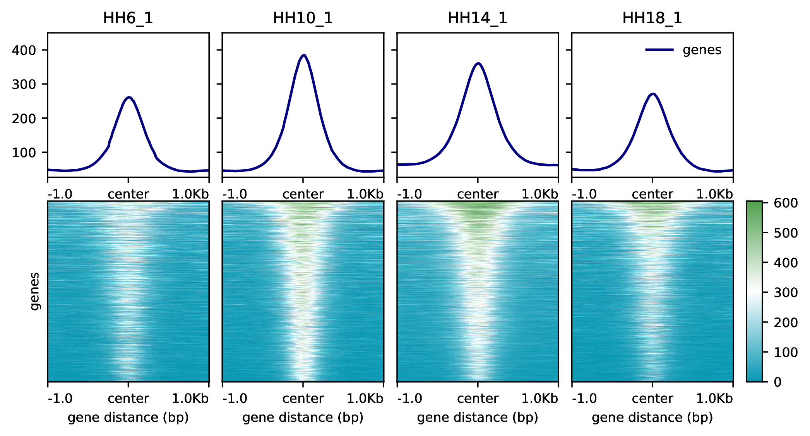
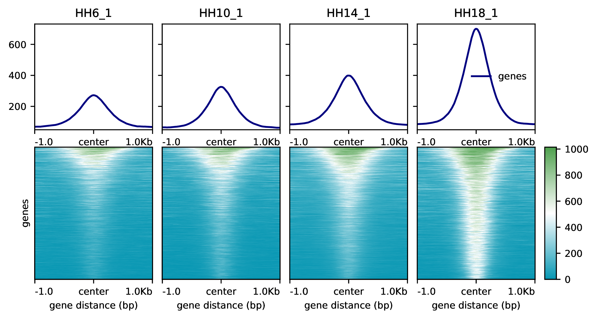

## ATAC-Seq Step 1: QC
Our first step in evaluating ATAC-Seq data is by running a variety of QC measures. We will operate on the dba object from diffbind to store the reads (bams) from our samples. For simplicity of github, we will just be working with the final object, but the bams can be found at `/data/Debbie/Sox2_Oct4_project/exports/Fig1/BAM`
```{r Libraries-1, echo=FALSE, message=FALSE, warning=FALSE}
library(GenomicRanges)
library(DiffBind)
library(BiocParallel)
library(rtracklayer)
library(tibble)
library(dplyr)
library(GenomicFeatures)
library(ChIPseeker)
BiocParallel::multicoreWorkers()
library(ggplot2)
library(ggrepel)
library(pheatmap)
library(ggsci)
library(Rsamtools)
library(GenomicAlignments)
library(ChIPQC)
```

Due to a bug with loading this information from a sample sheet, we are forced to add samples one at a time.
```{r creating db object, echo=TRUE, eval=FALSE}
setwd("/data/Debbie/Sox2_Oct4_project/exports/Fig1/BAM")
samples_ATAC <- dba.peakset(NULL,peaks="/home/ash274/local_git/NC_Timecourse/ATAC-Seq/Imports/all_ATAC_400bp_fixed.bed",
                            peak.caller="macs", peak.format= "macs",sampID="HH6_1",tissue="NC",
                            factor="ATAC",condition="early",replicate=1, bamReads="HH6_1.bam")
samples_ATAC <- dba.peakset(samples_ATAC,peaks="/home/ash274/local_git/NC_Timecourse/ATAC-Seq/Imports/all_ATAC_400bp_fixed.bed",
                            peak.caller="macs", peak.format= "macs",sampID="HH6_2",tissue="NC",
                            factor="ATAC",condition="early",replicate=2, bamReads="HH6_2.bam")
samples_ATAC <- dba.peakset(samples_ATAC,peaks="/home/ash274/local_git/NC_Timecourse/ATAC-Seq/Imports/all_ATAC_400bp_fixed.bed",
                            peak.caller="macs", peak.format= "macs",sampID="HH8_1",tissue="NC",
                            factor="ATAC",condition="early",replicate=1, bamReads="HH8_1.bam")
samples_ATAC <- dba.peakset(samples_ATAC,peaks="/home/ash274/local_git/NC_Timecourse/ATAC-Seq/Imports/all_ATAC_400bp_fixed.bed",
                            peak.caller="macs", peak.format= "macs",sampID="HH8_2",tissue="NC",
                            factor="ATAC",condition="early",replicate=2, bamReads="HH8_2.bam")
samples_ATAC <- dba.peakset(samples_ATAC,peaks="/home/ash274/local_git/NC_Timecourse/ATAC-Seq/Imports/all_ATAC_400bp_fixed.bed",
                            peak.caller="macs", peak.format= "macs",sampID="HH10_1",tissue="NC",
                            factor="ATAC",condition="mid",replicate=1, bamReads="HH10_1.bam")
samples_ATAC <- dba.peakset(samples_ATAC,peaks="/home/ash274/local_git/NC_Timecourse/ATAC-Seq/Imports/all_ATAC_400bp_fixed.bed",
                            peak.caller="macs", peak.format= "macs",sampID="HH10_2",tissue="NC",
                            factor="ATAC",condition="mid",replicate=2, bamReads="HH10_2.bam")
samples_ATAC <- dba.peakset(samples_ATAC,peaks="/home/ash274/local_git/NC_Timecourse/ATAC-Seq/Imports/all_ATAC_400bp_fixed.bed",
                            peak.caller="macs", peak.format= "macs",sampID="HH12_1",tissue="NC",
                            factor="ATAC",condition="mid",replicate=1, bamReads="HH12_1.bam")
samples_ATAC <- dba.peakset(samples_ATAC,peaks="/home/ash274/local_git/NC_Timecourse/ATAC-Seq/Imports/all_ATAC_400bp_fixed.bed",
                            peak.caller="macs", peak.format= "macs",sampID="HH12_2",tissue="NC",
                            factor="ATAC",condition="mid",replicate=2, bamReads="HH12_2.bam")
samples_ATAC <- dba.peakset(samples_ATAC,peaks="/home/ash274/local_git/NC_Timecourse/ATAC-Seq/Imports/all_ATAC_400bp_fixed.bed",
                            peak.caller="macs", peak.format= "macs",sampID="HH14_1",tissue="NC",
                            factor="ATAC",condition="mid",replicate=1, bamReads="HH14_1.bam")
samples_ATAC <- dba.peakset(samples_ATAC,peaks="/home/ash274/local_git/NC_Timecourse/ATAC-Seq/Imports/all_ATAC_400bp_fixed.bed",
                            peak.caller="macs", peak.format= "macs",sampID="HH14_2",tissue="NC",
                            factor="ATAC",condition="mid",replicate=1, bamReads="HH14_2.bam")
samples_ATAC <- dba.peakset(samples_ATAC,peaks="/home/ash274/local_git/NC_Timecourse/ATAC-Seq/Imports/all_ATAC_400bp_fixed.bed",
                            peak.caller="macs", peak.format= "macs",sampID="HH16_1",tissue="NC",
                            factor="ATAC",condition="late",replicate=1, bamReads="HH16_1.bam")
samples_ATAC <- dba.peakset(samples_ATAC,peaks="/home/ash274/local_git/NC_Timecourse/ATAC-Seq/Imports/all_ATAC_400bp_fixed.bed",
                            peak.caller="macs", peak.format= "macs",sampID="HH16_2",tissue="NC",
                            factor="ATAC",condition="late",replicate=2, bamReads="HH16_2.bam")
samples_ATAC <- dba.peakset(samples_ATAC,peaks="/home/ash274/local_git/NC_Timecourse/ATAC-Seq/Imports/all_ATAC_400bp_fixed.bed",
                            peak.caller="macs", peak.format= "macs",sampID="HH18_1",tissue="NC",
                            factor="ATAC",condition="late",replicate=1, bamReads="HH18_1.bam")
samples_ATAC <- dba.peakset(samples_ATAC,peaks="/home/ash274/local_git/NC_Timecourse/ATAC-Seq/Imports/all_ATAC_400bp_fixed.bed",
                            peak.caller="macs", peak.format= "macs",sampID="HH18_2",tissue="NC",
                            factor="ATAC",condition="late",replicate=2, bamReads="HH18_2.bam")
samples_ATAC <- dba.count(samples_ATAC, filter = 30, filterFun = mean)
samples_ATAC <- dba.contrast(samples_ATAC, categories = DBA_CONDITION, minMembers = 2)
samples_ATAC <- dba.analyze(samples_ATAC, bParallel = T)
dba.plotPCA(samples_ATAC, attributes = DBA_CONDITION)

saveRDS(samples_ATAC, file = "/home/ash274/local_git/NC_Timecourse/ATAC-Seq/Exports/samples_ATAC_400bp_2.RDS")

samples_ATAC <- readRDS(file = "./Exports/samples_ATAC_400bp.RDS")
```

Let's generate some QC metrics for these BAMs.
We will show one of the results as a demonstration, but this has been done for all libraries.
```{r, message=FALSE, collapse=TRUE}
TxDb_galGal6 <- makeTxDbFromEnsembl(organism = "Gallus gallus", release = 99)
#create a list of files that end with .noDupsSort.bam ($ specifies that the file ends there.)
setwd("/home/ash274/workdir/BAM")
bamFiles <- list.files(pattern = ".bam$")
Perform_ATAC_QC <- function(bam = ""){
      reads1 <- readGAlignmentPairs(bam, param = ScanBamParam(mapqFilter = 1, 
                flag = scanBamFlag(isPaired = TRUE, isProperPair = TRUE), what = c("qname","mapq", "isize")))
      idx_tb <- idxstatsBam(bam)
      idx_tb_filt <- idx_tb[0:35,]
      read_dist <-idx_tb_filt %>% ggplot(aes(seqnames, mapped, fill = seqnames)) + 
        geom_bar(stat = "identity") + coord_flip()
      idx_tb_filt$mapped[35] # number of mitochondrial reads
      percent.mito <- (idx_tb_filt$mapped[35]/sum(idx_tb_filt$mapped))*100
      #getting insert sizes
      atacReads_read1 <- GenomicAlignments::first(reads1)
      insertSizes <- abs(elementMetadata(atacReads_read1)$isize)
      fragLenPlot <- table(insertSizes) %>% data.frame %>% rename(InsertSize = insertSizes, 
                     Count = Freq) %>% mutate(InsertSize = as.numeric(as.vector(InsertSize)), 
                     Count = as.numeric(as.vector(Count))) %>% ggplot(aes(x = InsertSize, y = Count)) + 
                     geom_line() + xlim(c(0,800)) + theme_bw()
      openRegionPeaks <- samples_ATAC$peaks[[1]]
      qcRes <- ChIPQCsample(bam, peaks = openRegionPeaks, chromosomes = "2")
      MacsCalls_1_filteredAnno <- annotatePeak(qcRes, TxDb = TxDb_galGal6)
      output <- list(idx_tb,read_dist,percent.mito,fragLenPlot,MacsCalls_1_filteredAnno)
      return(output)
      }
#Perform QC on all bam files. Easiest is to run one per bam, but could do for file in bamFiles and return those results in one big list.
ATAC_QC_List_1 <- Perform_ATAC_QC(bamFiles[5])
ATAC_QC_List_1[[1]]
ATAC_QC_List_1[[2]]
ATAC_QC_List_1[[3]]
ATAC_QC_List_1[[4]]
ATAC_QC_List_1[[5]]


```


### PCA Plot
To ensure that our data reveals a time-resolved pattern, let's do PCA plots.
```{r PCA, echo=TRUE}
meta_dataframe <- as.data.frame(samples_ATAC$class)
pca <- dba.plotPCA(samples_ATAC)
x <- pca$panel.args[[1]]$x
y <- pca$panel.args[[1]]$y
pca_mat <- as.data.frame(matrix(c(x,y), nrow = 14, ncol = 2, byrow = F))
colnames(pca_mat) <- c("PC1","PC2")
rownames(pca_mat) <- colnames(meta_dataframe)

pca_mat$timepoint <- factor(c("HH6","HH6","HH8","HH8",
                       "HH10","HH10","HH12","HH12",
                       "HH14","HH14","HH16","HH16","HH18","HH18"),
                       levels = c("HH6","HH8","HH10","HH12","HH14","HH16","HH18"))
g <- ggplot(pca_mat, aes(x=PC1, y=PC2, color=timepoint)) + 
  geom_point(size = 4, alpha = 1) + 
  scale_color_npg() +
  labs(x = "PC1 51%" ,y = "PC2 17%") +
  theme(text=element_text(color="black", size = 10, face = "bold"),
        line=element_line(color="black", size = 2),
        axis.ticks = element_line(color = "black", size = 1),
        panel.background = element_blank(),
        panel.border = element_rect(fill=NA, color = "black", size = 2),
        axis.text = element_text(color="black", size = 10, face = "bold"),
        legend.key = element_blank()
  )

g

ggsave('./Exports/ATAC_PCA.eps', units = 'in', height = 4, width = 6, device = "eps")
```

## Generating Peaksets
```{r Generating Peaksets, echo=TRUE}
#exporting filesets
early_vs_late <- dba.report(samples_ATAC, contrast = 2, bUsePval = F)
#enriched_peaks
early_enriched <- as.data.frame(subset(early_vs_late, Fold > 0))
early_enriched$peakID <- paste0(early_enriched$seqnames,"_",early_enriched$start,"_", early_enriched$end)
late_enriched <- as.data.frame(subset(early_vs_late, Fold < 0))
late_enriched$peakID <- paste0(late_enriched$seqnames,"_",late_enriched$start,"_", late_enriched$end)

early_enriched_3k <- top_n(early_enriched, n = 3000, desc(Fold)) %>% dplyr::select(peakID, seqnames, start, end) %>% mutate(strand = rep("*"))
early_enriched_5k <- top_n(early_enriched, n = 5000, desc(Fold)) 

late_enriched_3k <- top_n(late_enriched, n = 3000, Fold) %>% dplyr::select(peakID, seqnames, start, end) %>% mutate(strand = rep("*"))
late_enriched_5k <- top_n(late_enriched, n = 5000, Fold)

############ early vs mid ----------------------------
early_vs_mid <- dba.report(samples_ATAC, contrast = 1, bUsePval = F)
early_vs_mid_enriched <- as.data.frame(subset(early_vs_mid, Fold > 0))
early_vs_mid_enriched$peakID <- paste0(early_vs_mid_enriched$seqnames,"_",early_vs_mid_enriched$start,"_", early_vs_mid_enriched$end)
early_vs_mid_enriched_3k <- top_n(early_vs_mid_enriched, n = 3000, desc(Fold)) %>% dplyr::select(peakID, seqnames, start, end) %>% mutate(strand = rep("*"))
early_vs_mid_enriched_5k <- top_n(early_vs_mid_enriched, n = 5000, desc(Fold))
early_vs_mid_depleted <- as.data.frame(subset(early_vs_mid, Fold < 0))
early_vs_mid_depleted$peakID <- paste0(early_vs_mid_depleted$seqnames,"_",early_vs_mid_depleted$start,"_", early_vs_mid_depleted$end)
early_vs_mid_depleted_3k <- top_n(early_vs_mid_depleted, n = 3000, Fold) %>% dplyr::select(peakID, seqnames, start, end) %>% mutate(strand = rep("*"))
early_vs_mid_depleted_5k <- top_n(early_vs_mid_depleted, n = 5000, Fold)


########### mid vs late ------------------------------
late_vs_mid <- dba.report(samples_ATAC, contrast = 3, bUsePval = F)
late_vs_mid_enriched <- as.data.frame(subset(late_vs_mid, Fold < 0))
late_vs_mid_enriched$peakID <- paste0(late_vs_mid_enriched$seqnames,"_",late_vs_mid_enriched$start,"_", late_vs_mid_enriched$end)
late_vs_mid_enriched_3k <- top_n(late_vs_mid_enriched, n = 3000, desc(Fold)) %>% dplyr::select(peakID, seqnames, start, end) %>% mutate(strand = rep("*"))
late_vs_mid_enriched_5k <- top_n(late_vs_mid_enriched, n = 5000, desc(Fold))
late_vs_mid_depleted <- as.data.frame(subset(late_vs_mid, Fold > 0))
late_vs_mid_depleted$peakID <- paste0(late_vs_mid_depleted$seqnames,"_",late_vs_mid_depleted$start,"_", late_vs_mid_depleted$end)
late_vs_mid_depleted_3k <- top_n(late_vs_mid_depleted, n = 3000, Fold) %>% dplyr::select(peakID, seqnames, start, end) %>% mutate(strand = rep("*"))
late_vs_mid_depleted_5k <- top_n(late_vs_mid_depleted, n = 5000, Fold)

top_18k_differential <- rbind(early_enriched_3k, late_enriched_3k, early_vs_mid_depleted_3k, early_vs_mid_enriched_3k, late_vs_mid_depleted_3k, late_vs_mid_enriched_3k)

```

We also want to generate peaksets definitive early, mid, and late peaksets.
```{r Unique Peaksets, echo=TRUE}
peaks_list <- as.data.frame(samples_ATAC$peaks)
peaks_list$peakID <- paste0(peaks_list$Chr, "_", peaks_list$Start, "_", peaks_list$End)

  
early_peaks <- unique(c(early_enriched_3k$peakID, early_vs_mid_enriched_3k$peakID))

early_peaks_bed <- subset(peaks_list, peaks_list$peakID %in% early_peaks)  %>% dplyr::select(peakID, Chr, Start, End) %>% mutate(strand = rep("*"))

mid_peaks <- unique(c(early_vs_mid_depleted_3k$peakID, late_vs_mid_depleted_3k$peakID))
mid_peaks_bed <- subset(peaks_list, peaks_list$peakID %in% mid_peaks)  %>% dplyr::select(peakID, Chr, Start, End) %>% mutate(strand = rep("*"))

late_peaks <- unique(c(late_enriched_3k$peakID, late_vs_mid_enriched_3k$peakID))
late_peaks_bed <- subset(peaks_list, peaks_list$peakID %in% late_peaks)  %>% dplyr::select(peakID, Chr, Start, End) %>% mutate(strand = rep("*"))

export(early_peaks_bed, con = "./Exports/early_peaks.bed", format= "BED")
export(mid_peaks_bed, con = "./Exports/mid_peaks.bed", format= "BED")
export(late_peaks_bed, con = "./Exports/late_peaks.bed", format= "BED")

```

## Normalized counts via DESeq2
While we have used diffbind to generate peaksets, we do not have an easy way to generate normalized counts directly from the diffbind object. Therefore, we must transform it into a DESeq2 object to generate a set of normalized counts for additional analysis.
```{r DESeq2, echo=TRUE}
# Running DeSeq to get Rlog counts
library(DESeq2)
summarized_experiment2 <- dba(samples_ATAC, bSummarizedExperiment = T)
summarized_experiment2@assays@data$scores <- summarized_experiment2@assays@data$Reads
#order of counts not correct.
dds_experiment2 <- DESeqDataSet(summarized_experiment2, design = ~ Condition)
dds_experiment2 <- DESeq(dds_experiment2)
dds_results <- results(dds_experiment2)
rld <- rlog(dds_experiment2, blind = FALSE)
rownames(assay(rld)) <- paste0(samples_ATAC$peaks[[1]]$Chr,"_",samples_ATAC$peaks[[1]]$Start,"_",samples_ATAC$peaks[[1]]$End)
rld_df <- data.frame(row.names = paste0(samples_ATAC$peaks[[1]]$Chr,"_",samples_ATAC$peaks[[1]]$Start,"_",samples_ATAC$peaks[[1]]$End),
           assay(rld))

write.table(rld_df, file = "./Exports/Rlog_counts_All_ATAC_Peaks", quote = F, sep = "\t", row.names = T)

library(pheatmap)

rld_df_avg <- data.frame(HH6 = rowMeans(rld_df[c('HH6_1', 'HH6_2')], na.rm=TRUE),
                         HH8 = rowMeans(rld_df[c('HH8_1', 'HH8_2')], na.rm=TRUE),
                         HH10 = rowMeans(rld_df[c('HH10_1', 'HH10_2')], na.rm=TRUE),
                         HH12 = rowMeans(rld_df[c('HH12_1', 'HH12_2')], na.rm=TRUE),
                         HH14 = rowMeans(rld_df[c('HH14_1', 'HH14_2')], na.rm=TRUE),
                         HH16 = rowMeans(rld_df[c('HH16_2', 'HH16_2')], na.rm=TRUE),
                         HH18 = rowMeans(rld_df[c('HH18_1', 'HH18_2')], na.rm=TRUE))

write.table(rld_df_avg, file = "./Exports/Rlog_counts_avergae_All_ATAC_Peaks", quote = F, sep = "\t", row.names = T)

colors <- colorRampPalette(c("#0584bc","#ffffff","#e45649"))(250)

ATAC_clusters = pheatmap(subset(rld_df_avg, rownames(rld_df_avg) %in% top_18k_differential$peakID),
                         cluster_cols = F, scale = "row", show_rownames = F, show_colnames = T,
                         color = colors,
                         filename = "./Exports/top_18k_peaks_heatmap.pdf", width = 6, height = 5)

#So it renders properly in html doc
pheatmap(subset(rld_df_avg, rownames(rld_df_avg) %in% top_18k_differential$peakID),
                         cluster_cols = F, scale = "row", show_rownames = F, show_colnames = T,
                         color = colorRampPalette(colors = c("#0797B3","#FFFFFF","#4FA14E"))(250))
```

While we generated early, mid, and late, peaks. There are some overlaping regions.
To generate unique peaksets, we use bedtools.
```{bash bedtools uniq, eval=FALSE}
cd ~/local_git/NC_Timecourse/ATAC-Seq/Exports
bedtools intersect -wa -a early_peaks.bed -b mid_peaks.bed late_peaks.bed -v | uniq > early_peaks_uniq.bed
bedtools intersect -wa -a mid_peaks.bed -b early_peaks.bed late_peaks.bed -v | uniq > mid_peaks_uniq.bed
bedtools intersect -wa -a late_peaks.bed -b early_peaks.bed mid_peaks.bed -v | uniq > late_peaks_uniq.bed
```

Let's visualize the signal at these peak sets across our samples.
```{bash computeMatrix and plotHeatmap, eval=FALSE}
#making heatmaps
#RPKM normalized bw files
computeMatrix reference-point -S HH6_1.bw HH10_1.bw HH14_1.bw HH18_1.bw -R early_peaks_uniq.bed -b 1000 -a 1000 -bs 5 -o early_peaks_alt_timepoints.mat.gz  --missingDataAsZero --referencePoint center
plotHeatmap -m early_peaks_alt_timepoints.mat.gz -out early_peaks_alt_timepoints_2.png --colorMap Blues --dpi 600 --heatmapHeight 5

computeMatrix reference-point -S HH6_1.bw HH10_1.bw HH14_1.bw HH18_1.bw -R late_peaks_uniq.bed -b 1000 -a 1000 -bs 5 -o late_peaks_alt_timepoints.mat.gz  --missingDataAsZero --referencePoint center
plotHeatmap -m late_peaks_alt_timepoints.mat.gz -out late_peaks_alt_timepoints.png --colorMap Blues --dpi 600 --heatmapHeight 5

computeMatrix reference-point -S HH6_1.bw HH10_1.bw HH14_1.bw HH18_1.bw -R mid_peaks_uniq.bed -b 1000 -a 1000 -bs 5 -o mid_peaks_alt_timepoints.mat.gz  --missingDataAsZero --referencePoint center
plotHeatmap -m mid_peaks_alt_timepoints.mat.gz -out mid_peaks_alt_timepoints_2.png --colorMap Blues --dpi 600 --heatmapHeight 5 --yMax 450
```

```{bash replotting with color changes, eval=FALSE}
plotHeatmap -m ./Exports/early_peaks_alt_timepoints.mat.gz -out ./Exports/early_peaks_alt_timepoints_2.eps --colorList "#0584bc","#ffffff","#e45649" --dpi 600 --heatmapHeight 5
plotHeatmap -m ./Exports/late_peaks_alt_timepoints.mat.gz -out ./Exports/late_peaks_alt_timepoints.eps --colorList "#0584bc","#ffffff","#e45649" --dpi 600 --heatmapHeight 5
plotHeatmap -m ./Exports/mid_peaks_alt_timepoints.mat.gz -out ./Exports/mid_peaks_alt_timepoints_2.eps --colorList "#0584bc","#ffffff","#e45649" --dpi 600 --heatmapHeight 5 --yMax 450

gs -dSAFER -dEPSCrop -r300 -sDEVICE=pngalpha -o ./Exports/early_peaks_alt_timepoints_2.png ./Exports/early_peaks_alt_timepoints_2.eps
gs -dSAFER -dEPSCrop -r300 -sDEVICE=pngalpha -o ./Exports/late_peaks_alt_timepoints.png ./Exports/late_peaks_alt_timepoints.eps
gs -dSAFER -dEPSCrop -r300 -sDEVICE=pngalpha -o ./Exports/mid_peaks_alt_timepoints_2.png ./Exports/mid_peaks_alt_timepoints_2.eps

```





